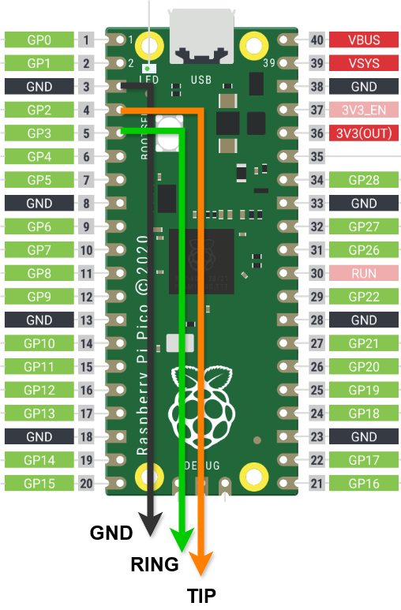

# TinyUSB MIDI Footswitch

Raspberry Pi Picoを使用したUSB MIDIフットスイッチデバイス

## すぐに使う

### 必要なもの

- **Raspberry Pi Pico** × 1
- **3.5mm TRSジャック対応フットスイッチ** × 1-2（またはTRSジャック + 個別スイッチ）

### ファームウェア書き込み

1. [GitHub Releases](https://github.com/cho45/tinyusbmidi/releases) から最新の `tinyusbmidi.uf2` をダウンロード
2. **BOOTSELボタン**を押しながらPicoをUSB接続
3. 表示された `RPI-RP2` ドライブに `.uf2` ファイルをコピー

### スイッチの配線



**デフォルト構成（2スイッチ）：**
```
TRSジャック（3.5mm ステレオ）
┌─ TIP ────→ GP2 (Switch 1)
├─ RING ───→ GP3 (Switch 2)
└─ SLEEVE ─→ GND
```

```
Raspberry Pi Pico配線
GP2  ●────── TIP (Switch 1)
GP3  ●────── RING (Switch 2)  
GND  ●────── SLEEVE (GND)
```

内部プルアップを利用しているので追加のパーツは不要です。

> **注意**: カスタムGPIOピン設定でビルドした場合は、設定したピン番号に合わせて配線してください。

### 設定変更

[オンライン設定ツール](https://cho45.github.io/tinyusbmidi/) でMIDIメッセージをカスタマイズできます。

## 開発者向け

### ビルド環境

**簡単：** VSCode + Raspberry Pi Pico拡張機能を使うと環境構築が簡単です

**手動：** Pico SDK、CMake、ARM GCCが必要

```bash
# ビルド手順
mkdir build && cd build

# デフォルト設定（GP2, GP3）
cmake .. -G Ninja

# カスタムGPIOピン設定
cmake .. -G Ninja -DGPIO_PINS="2,3,4,5"

# ビルド実行
ninja
```

### プロジェクト構成

```
├── tinyusbmidi.c           # メイン実装
├── usb_descriptors.c       # USB MIDI記述子
├── tusb_config.h           # TinyUSB設定
├── CMakeLists.txt          # ビルド設定
└── config-app/             # WebMIDI設定ツール（ローカル版）
    ├── index.html
    ├── app.js
    └── midi-manager.js
```

### GPIOピン設定

ビルド時にCMakeオプションで任意のGPIOピンを設定できます：

```bash
# デフォルト（2ピン）
cmake .. -G Ninja

# 4ピン設定
cmake .. -G Ninja -DGPIO_PINS="2,3,4,5"

# 任意の組み合わせ
cmake .. -G Ninja -DGPIO_PINS="3,5,7,9,11"
```

**設定可能な範囲：**
- **ピン数**: 1〜16個まで
- **GPIO番号**: RP2040の有効なGPIO（0-28）
- **内部プルアップ**: 自動で有効化
- **配線**: 各ピンをスイッチのオープンドレインで接続

### 技術仕様

#### ハードウェア
- **MCU**: RP2040
- **GPIO**: デフォルトGP2(TIP), GP3(RING) - 内部プルアップ有効（ビルド時設定可能）
- **最大スイッチ数**: 16個まで対応
- **デバウンス**: 20ms

#### MIDI機能
- **デバイス名**: TinyUSB MIDI Footswitch
- **対応メッセージ**: CC、PC、Note On/Off
- **設定保存**: フラッシュメモリ（256KB offset）

### デバッグ

**シリアル出力**
```bash
# GP0(TX), GP1(RX) - 115200 baud
# picotoolでの書き込み
picotool load tinyusbmidi.uf2
picotool reboot
```
### トラブルシューティング

**デバイスが認識されない**
- ファームウェアの書き込み確認
- USBケーブル・ポート確認

**スイッチが反応しない**
- TRSジャック配線確認
- スイッチの導通確認（テスター使用）

**設定が保存されない**
- SysExフォーマット確認
- 電源再投入で動作確認
