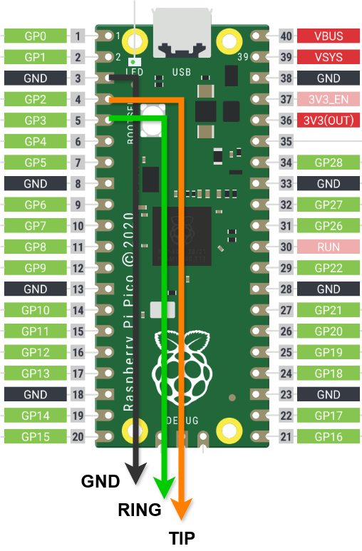

# PicoMIDI Switch

Raspberry Pi Picoを使用したUSB MIDIフットスイッチデバイス

## すぐに使う

### 必要なもの

- **Raspberry Pi Pico** × 1
- **3.5mm TRSジャック対応フットスイッチ** × 1-2（またはTRSジャック + 個別スイッチ）

### ファームウェア書き込み

1. [GitHub Releases](https://github.com/cho45/picomidi/releases) から最新の `picomidi.uf2` をダウンロード
2. **BOOTSELボタン**を押しながらPicoをUSB接続
3. 表示された `RPI-RP2` ドライブに `.uf2` ファイルをコピー

### スイッチの配線



**デフォルト構成（2スイッチ）：**
```
TRSジャック（3.5mm ステレオ）
┌─ TIP ────→ GP2 (Switch 1)
├─ RING ───→ GP3 (Switch 2)
└─ SLEEVE ─→ GND
```

```
Raspberry Pi Pico配線
GP2  ●────── TIP (Switch 1)
GP3  ●────── RING (Switch 2)  
GND  ●────── SLEEVE (GND)
```

内部プルアップを利用しているので追加のパーツは不要です。

> **注意**: カスタムGPIOピン設定でビルドした場合は、設定したピン番号に合わせて配線してください。

### 設定変更

#### オンライン設定ツール
[https://cho45.github.io/picomidi/](https://cho45.github.io/picomidi/)

#### ローカル設定ツール
```bash
cd config-app
npm run serve
# ブラウザで http://localhost:3000 を開く
```

**設定ツールの特徴:**
- **WebMIDI API** による直接通信
- **複数スイッチ対応** - デバイスのピン数に応じて動的にUI生成
- **複数メッセージ** - 各スイッチのPress/Releaseで最大10個のMIDIメッセージを設定
- **リアルタイム変更検出** - 未保存変更の視覚的フィードバック
- **設定バックアップ** - JSON形式でのローカル保存/読み込み

## 開発者向け

### ビルド環境

**簡単：** VSCode + Raspberry Pi Pico拡張機能を使うと環境構築が簡単です

**手動：** Pico SDK、CMake、ARM GCCが必要

```bash
# ビルド手順
mkdir build && cd build

# デフォルト設定（GP2, GP3）
cmake .. -G Ninja

# カスタムGPIOピン設定
cmake .. -G Ninja -DGPIO_PINS="2,3,4,5"

# ビルド実行
ninja
```

### プロジェクト構成

```
├── picomidi.c              # メイン実装
├── usb_descriptors.c       # USB MIDI記述子
├── tusb_config.h           # TinyUSB設定
├── CMakeLists.txt          # ビルド設定
└── config-app/             # WebMIDI設定ツール (Vue.js 3 + WebMIDI API)
    ├── index.html           # メインHTML（Vue.js CDN読み込み）
    ├── app.js               # Vue.js 3 Composition API アプリケーション
    ├── midi-manager.js      # WebMIDI API ラッパーとSysExプロトコル
    ├── style.css            # ダークテーマUI + レスポンシブデザイン
    ├── package.json         # NPM設定（v2.0.0, ESLint設定含む）
    ├── eslint.config.js     # ESLint設定
    └── README.md            # 設定ツール詳細仕様
```

### GPIOピン設定

ビルド時にCMakeオプションで任意のGPIOピンを設定できます：

```bash
# デフォルト（2ピン）
cmake .. -G Ninja

# 4ピン設定
cmake .. -G Ninja -DGPIO_PINS="2,3,4,5"

# 任意の組み合わせ
cmake .. -G Ninja -DGPIO_PINS="3,5,7,9,11"
```

**設定可能な範囲：**
- **ピン数**: 1〜16個まで
- **GPIO番号**: RP2040の有効なGPIO（0-28）
- **内部プルアップ**: 自動で有効化
- **配線**: 各ピンをスイッチのオープンドレインで接続

### 技術仕様

#### ハードウェア
- **MCU**: RP2040
- **GPIO**: デフォルトGP2(TIP), GP3(RING) - 内部プルアップ有効（ビルド時設定可能）
- **最大スイッチ数**: 16個まで対応
- **デバウンス**: 20ms

#### MIDI機能
- **デバイス名**: PicoMIDI Switch
- **対応メッセージ**: CC、PC、Note On/Off
- **設定保存**: フラッシュメモリ（256KB offset）

#### WebMIDI設定ツール (Vue.js 3)
- **app.js**: Vue.js 3 Composition API アプリケーション（リアクティブ状態管理）
- **midi-manager.js**: WebMIDI API ラッパー（イベント駆動 SysEx プロトコル）
- **index.html**: 複数スイッチ・複数メッセージ対応動的UI
- **style.css**: ダークテーマ（ローディング状態・変更インジケーター付き）

**主要機能:**
- **自動接続**: PicoMIDI Switch の自動検出・接続
- **マルチスイッチUI**: デバイスのスイッチ数に応じた動的インターフェース生成
- **マルチメッセージ管理**: スイッチイベント毎に最大10個のメッセージを直感的UI で設定
- **リアルタイム変更検出**: 未保存変更のディープ比較による視覚的フィードバック
- **ローディング状態**: 設定読み込み・保存時のUI無効化
- **ファイル操作**: JSON形式での設定バックアップ・復元
- **ライブログ**: リアルタイムMIDI・SysEx通信モニター

### デバッグ

**シリアル出力**
```bash
# GP0(TX), GP1(RX) - 115200 baud
# picotoolでの書き込み
picotool load picomidi.uf2
picotool reboot
```
### トラブルシューティング

**デバイスが認識されない**
- ファームウェアの書き込み確認
- USBケーブル・ポート確認

**スイッチが反応しない**
- TRSジャック配線確認
- スイッチの導通確認（テスター使用）

**設定が保存されない**
- SysExフォーマット確認
- 電源再投入で動作確認
